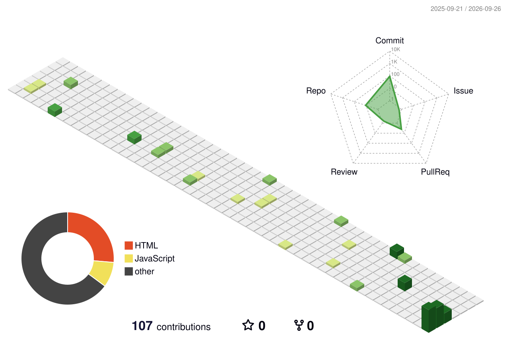

<!-- ========================================================= -->
<!--                 AYUSH SRIVASTAVA                          -->
<!--              GITHUB PROFILE README                        -->
<!-- ========================================================= -->

<!-- ========================================================= -->
<!--                         HERO                              -->
<!-- ========================================================= -->

<picture>
  <source
    media="(prefers-color-scheme: dark)"
    srcset="https://raw.githubusercontent.com/ayushsrivastava0159/ayushsrivastava0159/main/dark.svg"
  />

  <source
    media="(prefers-color-scheme: light)"
    srcset="https://raw.githubusercontent.com/ayushsrivastava0159/ayushsrivastava0159/main/light.svg"
  />

  
</picture>

 

  

  

 

---

<!-- ========================================================= -->
<!--                       ABOUT ME                             -->
<!-- ========================================================= -->

<h2>👨‍💻 ABOUT ME</h2>

<table width="92%">
<tr>

<td width="50%" valign="top">

<h3>🚀 Who I Am</h3>

I'm <b>Ayush Srivastava</b>, focused on building modern software products
and intelligent applications.

🎓 <b>B.Tech Computer Science</b> 
🏫 <b>PW Institute of Innovation, Lucknow</b>

<h3>🔧 Areas I Work On</h3>

<ul>
<li>Software Development</li>
<li>Frontend Engineering</li>
<li>Agentic AI</li>
<li>Intelligent Automation</li>
<li>API Integration</li>
<li>Database Systems</li>
<li>Data Structures & Algorithms</li>
<li>Real-world Problem Solving</li>
</ul>

</td>

<td width="50%" valign="top">

<h3>⚡ Currently Exploring</h3>

React.js 
Next.js 
TypeScript 
Node.js 
Java 
DSA 
AI Development 
APIs 
Databases 
Automation

</td>

</tr>
</table>

 

---
<!-- ========================================================= -->
<!--                       TECH STACK                           -->
<!-- ========================================================= -->

# ⚙️ Tech Stack

 

## Frontend Development

<table>
<tr>

<td align="center" width="150">
 
<strong>React</strong>
</td>

<td align="center" width="150">
 
<strong>JavaScript</strong>
</td>

<td align="center" width="150">
 
<strong>TypeScript</strong>
</td>

<td align="center" width="150">
 
<strong>HTML5</strong>
</td>

<td align="center" width="150">
 
<strong>CSS3</strong>
</td>

<td align="center" width="150">
 
<strong>Bootstrap</strong>
</td>

<td align="center" width="150">
 
<strong>Next.js</strong>
</td>

</tr>
</table>

 

## Backend Development

<table>
<tr>

<td align="center" width="150">
 
<strong>Node.js</strong>
</td>

<td align="center" width="150">
 
<strong>Java</strong>
</td>

<td align="center" width="150">
 
<strong>C++</strong>
</td>

<td align="center" width="150">
 
<strong>C</strong>
</td>

<td align="center" width="150">
 
<strong>Python</strong>
</td>

</tr>
</table>

 

## Database & DevOps

<table>
<tr>

<td align="center" width="150">
 
<strong>MySQL</strong>
</td>

<td align="center" width="150">
 
<strong>MongoDB</strong>
</td>

<td align="center" width="150">
 
<strong>Firebase</strong>
</td>

<td align="center" width="150">
 
<strong>Git</strong>
</td>

<td align="center" width="150">
 
<strong>GitHub</strong>
</td>

<td align="center" width="150">
 
<strong>Linux</strong>
</td>

<td align="center" width="150">
 
<strong>Postman</strong>
</td>

</tr>
</table>

 

---
 

<h2>🌿 3D CONTRIBUTION ACTIVITY 🌿</h2>

 

 

<!-- ========================================================= -->
<!--                  CONTRIBUTION SNAKE                       -->
<!-- ========================================================= -->

# 🐍 Contribution Snake

 

<picture>

<source
  media="(prefers-color-scheme: dark)"
  srcset="https://raw.githubusercontent.com/ayushsrivastava0159/ayushsrivastava0159/output/github-snake-dark.svg"
/>

<source
  media="(prefers-color-scheme: light)"
  srcset="https://raw.githubusercontent.com/ayushsrivastava0159/ayushsrivastava0159/output/github-snake.svg"
/>

</picture>

 

---
<!-- ========================================================= -->
<!--                    GITHUB PROFILE                          -->
<!-- ========================================================= -->

<h2>📊 GITHUB PROFILE</h2>

 

<!-- ========================================================= -->
<!--                 PROFILE DETAILS                            -->
<!-- ========================================================= -->

  

<!-- ========================================================= -->
<!--                    STATS ROW                               -->
<!-- ========================================================= -->

<table width="92%">
<tr>

<td width="50%" valign="top" align="center">

</td>

<td width="50%" valign="top" align="center">

</td>

</tr>
</table>

 

<!-- ========================================================= -->
<!--                  LANGUAGE ROW                              -->
<!-- ========================================================= -->

<table width="92%">
<tr>

<td width="50%" valign="top" align="center">

</td>

<td width="50%" valign="top" align="center">

</td>

</tr>
</table>

 
